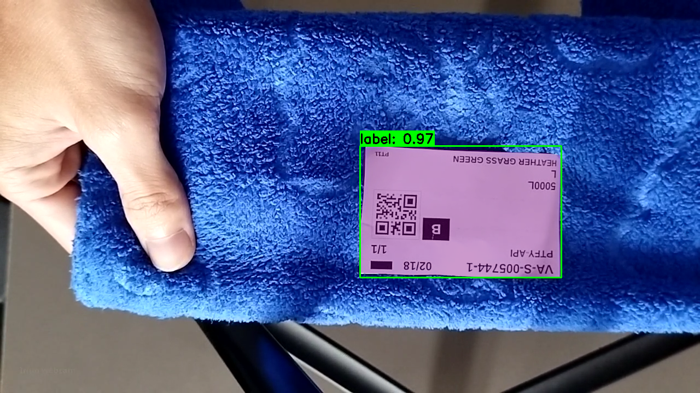
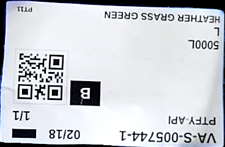
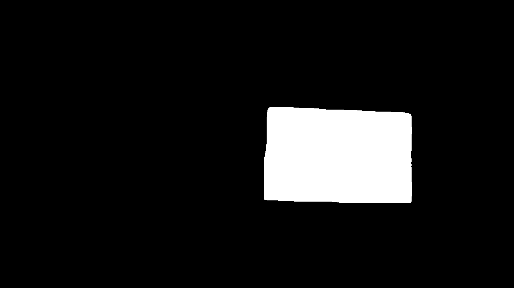
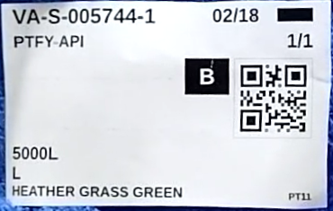
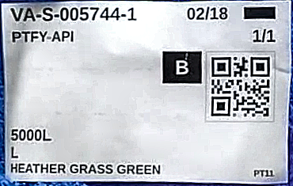
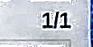
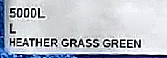
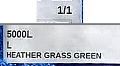

# Label Detection Pipeline - Tóm tắt kỹ thuật

## Tổng quan

Pipeline trích xuất thông tin từ nhãn sản phẩm gồm 8 bước tuần tự:

1. **S1 - Camera**: Thu nhận hình ảnh từ camera
2. **S2 - Detection**: Phát hiện vùng nhãn bằng YOLO
3. **S3 - Preprocessing**: Cắt, xoay và sửa hướng nhãn
4. **S4 - Enhancement**: Tăng cường độ sáng và độ nét
5. **S5 - QR Detection**: Phát hiện và giải mã mã QR
6. **S6 - Component Extraction**: Trích xuất vùng chứa text
7. **S7 - OCR**: Nhận dạng ký tự từ ảnh
8. **S8 - Postprocessing**: Fuzzy matching và xác thực kết quả

---

## Chi tiết từng bước (Ví dụ: `frame_20251219_111858_200`)

### S1 - Camera Service

| Hạng mục | Chi tiết |
|----------|----------|
| Xử lý | Thu nhận khung hình từ camera, tạo Frame ID duy nhất |
| Kỹ thuật | OpenCV VideoCapture |
| Output | Ảnh gốc + Frame ID + Timestamp |

---

### S2 - Detection Service

| Hạng mục | Chi tiết |
|----------|----------|
| Xử lý | Phát hiện vùng chứa nhãn trong ảnh |
| Kỹ thuật | YOLO11 Instance Segmentation (ONNX Runtime) |
| Lọc kết quả | Ngưỡng độ tin cậy, Tỷ lệ diện tích tối đa, Giữ lại N detection tốt nhất |
| Output | Bounding box + Segmentation mask |

**Debug Output:**



| Detection | Cropped | Mask |
|-----------|---------|------|
|  |  |  |

```json
{
  "frameId": "frame_20251219_111858_200",
  "numDetections": 1,
  "detections": [
    {
      "className": "label",
      "confidence": 0.9696968793869019,
      "bbox": [658, 267, 1026, 508],
      "hasMask": true
    }
  ]
}
```

---

### S3 - Preprocessing Service

| Hạng mục | Chi tiết |
|----------|----------|
| Xử lý | Cắt vùng nhãn, xoay về hướng chuẩn, sửa lỗi ngược 180 độ |
| Kỹ thuật | Geometric Transform (OpenCV), PaddlePaddle Orientation Classification |
| Output | Ảnh nhãn đã crop và căn chỉnh đúng hướng |

**Debug Output:**



```json
{
  "frameId": "frame_20251219_111858_200",
  "rotationAngle": 0.0,
  "orientationFixed": false,
  "imageShape": [235, 370, 3],
  "contourPointsCount": 101
}
```

---

### S4 - Enhancement Service

| Hạng mục | Chi tiết |
|----------|----------|
| Xử lý | Tăng cường độ sáng và độ nét ảnh |
| Kỹ thuật | CLAHE trên không gian màu LAB (brightness), Unsharp Masking (sharpness) |
| Output | Ảnh đã tăng cường chất lượng |

**Debug Output:**



```json
{
  "frameId": "frame_20251219_111858_200",
  "brightnessApplied": true,
  "sharpnessApplied": true,
  "imageShape": [235, 370, 3]
}
```

---

### S5 - QR Detection Service

| Hạng mục | Chi tiết |
|----------|----------|
| Xử lý | Phát hiện và giải mã mã QR trên nhãn |
| Kỹ thuật | zxing-cpp (C++ barcode library) |
| Format QR | MMDDYY-FACILITY-TYPE-ORDER-POSITION |
| Output | QR data (dateCode, facility, orderType, orderNumber, position) + Polygon 4 góc |

**Debug Output:**

```json
{
  "frameId": "frame_20251219_111858_200",
  "text": "021825-VA-S-005744-1",
  "polygon": [[267, 73], [341, 72], [340, 147], [267, 147]],
  "rect": [267, 72, 74, 75],
  "confidence": 1.0,
  "parsed": {
    "dateCode": "021825",
    "facility": "VA",
    "orderType": "S",
    "orderNumber": "005744",
    "position": 1
  }
}
```

---

### S6 - Component Extraction Service

| Hạng mục | Chi tiết |
|----------|----------|
| Xử lý | Trích xuất vùng text dựa trên vị trí mã QR |
| Kỹ thuật | Region-based extraction với tỷ lệ cấu hình, Image concatenation |
| Vùng trích xuất | Above QR (Product Code), Below QR (Size, Color) |
| Output | Ảnh merged chứa các vùng text |

**Debug Output:**

| Above QR | Below QR | Merged |
|----------|----------|--------|
|  |  |  |

```json
{
  "frameId": "frame_20251219_111858_200",
  "mergedImageShape": [133, 240, 3],
  "aboveQrRoiShape": [47, 93, 3],
  "belowQrRoiShape": [83, 240, 3]
}
```

---

### S7 - OCR Service

| Hạng mục | Chi tiết |
|----------|----------|
| Xử lý | Nhận dạng ký tự từ ảnh text |
| Kỹ thuật | PaddleOCR (Text Detection + Text Recognition) |
| Output | Danh sách Text Block (text, position, confidence) |

**Debug Output:**

```json
{
  "frameId": "frame_20251219_111858_200",
  "textBlocks": [
    {
      "text": "1/1",
      "confidence": 0.9988415241241455,
      "bbox": [[111, 7], [146, 7], [146, 32], [111, 32]]
    },
    {
      "text": "5000L",
      "confidence": 0.9949346780776978,
      "bbox": [[10, 55], [68, 57], [67, 80], [9, 78]]
    },
    {
      "text": "HEATHER GRASS GREEN",
      "confidence": 0.9913316965103149,
      "bbox": [[10, 100], [205, 102], [205, 121], [10, 118]]
    }
  ]
}
```

---

### S8 - Postprocessing Service

| Hạng mục | Chi tiết |
|----------|----------|
| Xử lý | Sửa lỗi OCR và xác thực kết quả với QR data |
| Kỹ thuật | Fuzzy Matching (Levenshtein distance) với database Products/Sizes/Colors |
| Validation | So sánh OCR result với QR data |
| Output | LabelData (productCode, size, color, isValid) |

**Debug Output:**

```json
{
  "frameId": "frame_20251219_111858_200",
  "labelData": {
    "fullOrderCode": "021825-VA-S-005744-1",
    "dateCode": "021825",
    "facility": "VA",
    "orderType": "S",
    "orderNumber": "005744",
    "qrPosition": 1,
    "positionQuantity": "1/1",
    "ocrPosition": 1,
    "quantity": 1,
    "productCode": "5000L",
    "size": "",
    "color": "HEATHER GRASS GREEN",
    "isValid": true,
    "fieldConfidences": {
      "positionQuantity": 0.9988415241241455,
      "productCode": 0.9949346780776978,
      "color": 0.9913316965103149
    }
  },
  "processingTimeMs": 1.4660358428955078
}
```

---

## Thời gian xử lý

| Bước | Thời gian (ms) |
|------|----------------|
| S1 - Camera | 0.97 |
| S2 - Detection | 184.66 |
| S3 - Preprocessing | 7.25 |
| S4 - Enhancement | 2.68 |
| S5 - QR Detection | 0.45 |
| S6 - Component Extraction | 0.14 |
| S7 - OCR | 120.67 |
| S8 - Postprocessing | 1.47 |
| **Tổng Pipeline** | **487.36** |
| **FPS** | **2.05** |

---

## Công nghệ sử dụng

| Thành phần | Công nghệ |
|------------|-----------|
| Object Detection | YOLO11 Instance Segmentation |
| Inference Runtime | ONNX Runtime |
| Image Processing | OpenCV |
| Orientation Fix | PaddlePaddle |
| QR Detection | zxing-cpp |
| OCR | PaddleOCR |
| Text Matching | RapidFuzz (Fuzzy Matching) |
| Configuration | JSON-based config |
