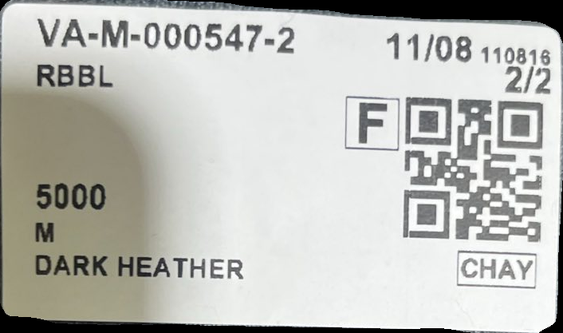
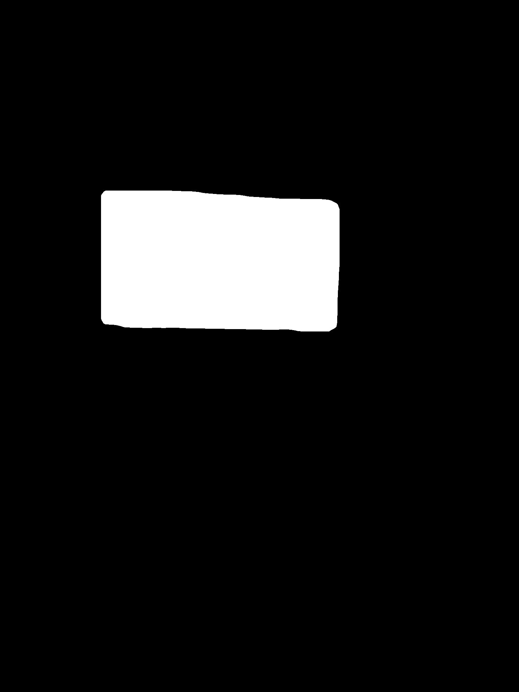
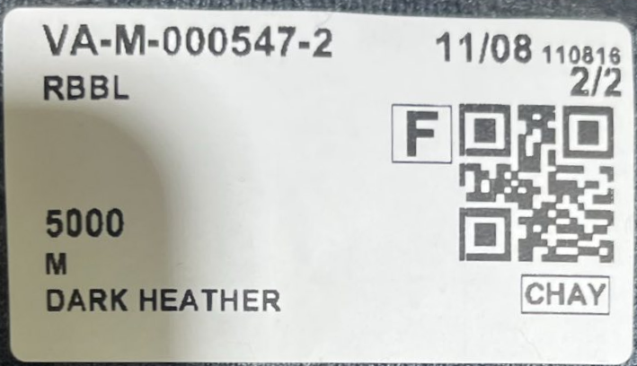
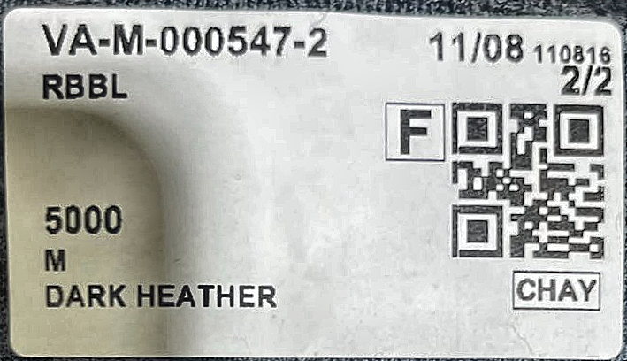
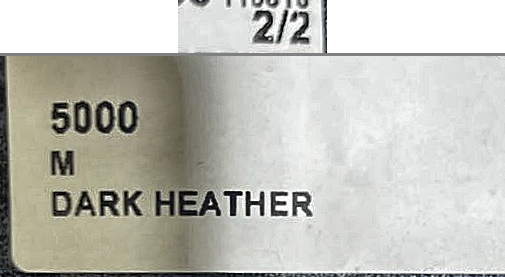
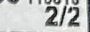
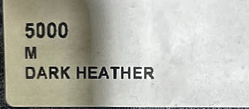

# ML Pipelines - Label Detection Pipeline

## Tổng quan

Hệ thống trích xuất thông tin từ nhãn sản phẩm được thiết kế theo kiến trúc pipeline gồm 8 bước tuần tự. Mỗi bước đảm nhận một nhiệm vụ cụ thể, nhận đầu vào từ bước trước và truyền kết quả cho bước tiếp theo.

Luồng xử lý tổng quát:

1. **S1 - Camera**: Thu nhận hình ảnh từ camera
2. **S2 - Detection**: Phát hiện vùng nhãn bằng YOLO
3. **S3 - Preprocessing**: Cắt, xoay và sửa hướng nhãn
4. **S4 - Enhancement**: Tăng cường độ sáng và độ nét
5. **S5 - QR Detection**: Phát hiện và giải mã mã QR
6. **S6 - Component Extraction**: Trích xuất vùng chứa text
7. **S7 - OCR**: Nhận dạng ký tự từ ảnh
8. **S8 - Postprocessing**: Fuzzy matching và xác thực kết quả

---

## S1 - Camera Service

### Mục đích

Thu nhận hình ảnh từ camera và tạo định danh duy nhất cho mỗi khung hình.

### Xử lý

1. **Thiết lập kết nối camera**
   - Sử dụng `OpenCVCamera` để quản lý kết nối camera.
   - Tìm kiếm camera khả dụng bằng cách quét tối đa `maxCameraSearch` camera index.
   - Mở camera với độ phân giải cấu hình (`frameWidth` x `frameHeight`).

2. **Chụp khung hình**
   - Gọi `read()` để lấy frame từ camera đã mở.
   - Kiểm tra trạng thái thành công trước khi xử lý tiếp.

3. **Tạo Frame ID**
   - Sinh Frame ID duy nhất theo format: `frame_YYYYMMDD_HHMMSS_milliseconds`.
   - Sử dụng `datetime.now()` để lấy timestamp chính xác đến mili giây.
   - Ví dụ: `frame_20251220_143052_123`

4. **Đóng gói kết quả**
   - Trả về đối tượng `CameraFrame` chứa:
     - `image`: Ảnh gốc từ camera (numpy array BGR).
     - `frameId`: Định danh duy nhất.
     - `timestamp`: Thời điểm chụp.
     - `success`: Trạng thái thành công/thất bại.
     - `processingTimeMs`: Thời gian xử lý.

### Đầu ra

- Ảnh gốc từ camera (numpy array BGR format)
- Frame ID để theo dõi xuyên suốt pipeline
- Timestamp ghi nhận thời điểm chụp
- Trạng thái thành công và thời gian xử lý

### Ví dụ Debug Output

Frame ID được tạo theo format: `signal-004`

---

## S2 - Detection Service

### Mục đích

Phát hiện vùng chứa nhãn trong ảnh bằng mô hình YOLO11 Instance Segmentation.

### Xử lý

1. **Nạp mô hình YOLO**
   - Sử dụng `YOLODetector` với ONNX Runtime để chạy inference.
   - Cấu hình: `inputSize` (640), `isSegmentation` (True), `classNames` (["label"]).
   - Nạp mô hình từ file `.onnx` khi khởi động service.

2. **Tiền xử lý ảnh (Preprocess)**
   - Resize ảnh về kích thước input của model (640x640).
   - Chuyển đổi màu BGR sang RGB.
   - Chuẩn hóa giá trị pixel về khoảng [0, 1].
   - Chuyển đổi định dạng từ HWC sang CHW.
   - Thêm batch dimension.

3. **Chạy Inference**
   - Thực thi mô hình với ONNX Runtime.
   - Đầu ra gồm 2 phần:
     - `outputs[0]`: Bbox + class scores + 32 mask coefficients
     - `outputs[1]`: Proto masks [1, 32, 160, 160]

4. **Hậu xử lý (Postprocess)**
   - Parse raw output để lấy bounding box và class scores.
   - Lọc theo confidence threshold: `confidenceThreshold`.
   - Scale bounding box về kích thước ảnh gốc.
   - Áp dụng Non-Maximum Suppression (NMS) với `nmsThreshold = 0.45`.
   - Giải mã segmentation mask:
     - Tính toán: `mask = sigmoid(maskCoeffs @ protoMasks)`
     - Resize mask về kích thước ảnh gốc.
     - Chuyển thành binary mask (threshold = 0.5).

5. **Lọc kết quả phát hiện**
   - Lọc theo `maxAreaRatio`: Loại bỏ detection chiếm diện tích quá lớn.
   - Sắp xếp theo confidence giảm dần.
   - Chỉ giữ lại `topNDetections` detection tốt nhất.

### Đầu ra

- Danh sách `Detection` với:
  - `bbox`: Bounding box (x1, y1, x2, y2)
  - `className`: Tên lớp ("label")
  - `confidence`: Điểm tin cậy
  - `mask`: Binary segmentation mask (numpy array uint8, 0 hoặc 255)

### Ví dụ Debug Output

**JSON**: [examples/signal-004/detection_signal-004.json](examples/signal-004/detection_signal-004.json)

```json
{
  "frameId": "signal-004",
  "numDetections": 1,
  "detections": [
    {
      "className": "label",
      "confidence": 0.9516175985336304,
      "bbox": [299, 564, 1005, 981],
      "hasMask": true
    }
  ]
}
```

**Ảnh minh họa**:

| Detection Annotated | Cropped Label | Segmentation Mask |
|:-------------------:|:-------------:|:-----------------:|
|  |  |  |

---

## S3 - Preprocessing Service

### Mục đích

Cắt vùng nhãn từ ảnh gốc, xoay về hướng chuẩn và sửa lỗi hướng ngược.

### Xử lý

1. **Trích xuất Contour Points**
   - Chuyển segmentation mask thành binary mask (uint8).
   - Sử dụng `cv2.findContours()` để tìm contour.
   - Chọn contour lớn nhất làm vùng nhãn.
   - Chuyển contour thành danh sách tọa độ [x, y].

2. **Biến đổi hình học (Crop & Rotate)**
   - Sử dụng `GeometricTransformer.applyCropAndRotate()`:
     - Tìm minimum area rectangle bao quanh contour với `cv2.minAreaRect()`.
     - Lấy 4 điểm góc của rectangle với `cv2.boxPoints()`.
     - Sắp xếp 4 điểm theo thứ tự: Top-Left, Top-Right, Bottom-Right, Bottom-Left.
     - Tính kích thước ảnh đầu ra dựa trên chiều dài các cạnh.
     - Tính ma trận Affine Transform với `cv2.getAffineTransform()`.
     - Áp dụng `cv2.warpAffine()` để cắt và xoay ảnh.

3. **Xoay về hướng Landscape**
   - Kiểm tra kích thước ảnh: `height > width`?
   - Nếu đang Portrait (dọc), xoay 90 độ theo chiều kim đồng hồ với `cv2.ROTATE_90_CLOCKWISE`.
   - Đảm bảo ảnh luôn ở định dạng Landscape (ngang).

4. **AI Orientation Fix (Sửa lỗi ngược 180 độ)**
   - Sử dụng mô hình `DocImgOrientationClassification` từ PaddleOCR.
   - Resize ảnh xuống `maxWidth = 1000` để tăng tốc độ inference.
   - Chạy classifier để dự đoán hướng: 0, 90, 180, 270 độ.
   - Nếu dự đoán là 180 độ và confidence > `aiConfidenceThreshold`:
     - Xoay ảnh 180 độ với `cv2.ROTATE_180`.
   - Nếu không đủ confident, giữ nguyên ảnh.

### Đầu ra

- Ảnh nhãn đã được crop và căn chỉnh đúng hướng
- Danh sách contour points (dùng cho debug)
- Trạng thái thành công và thời gian xử lý

### Ví dụ Debug Output

**JSON**: [examples/signal-004/preprocessing_signal-004.json](examples/signal-004/preprocessing_signal-004.json)

```json
{
  "frameId": "signal-004",
  "rotationAngle": 0.0,
  "orientationFixed": false,
  "imageShape": [408, 709, 3],
  "contourPointsCount": 200
}
```

**Ảnh minh họa**:



---

## S4 - Enhancement Service

### Mục đích

Tăng cường chất lượng ảnh để cải thiện độ chính xác OCR.

### Xử lý

1. **Brightness Enhancement (Cân bằng độ sáng)**
   - Sử dụng `BrightnessEnhancer` với thuật toán CLAHE:
     - Chuyển ảnh từ BGR sang LAB color space với `cv2.cvtColor()`.
     - Tách 3 kênh: L (Lightness), A, B với `cv2.split()`.
     - Tạo CLAHE object với cấu hình:
       - `clipLimit`: Giới hạn contrast để tránh khuếch đại nhiễu (mặc định: 2.5).
       - `tileGridSize`: Kích thước ô chia ảnh (mặc định: 8x8).
     - Áp dụng CLAHE chỉ trên kênh L: `clahe.apply(lChannel)`.
     - Gộp lại 3 kênh và chuyển về BGR.
   - Ưu điểm: Bảo toàn màu sắc, chỉ xử lý độ sáng.

2. **Sharpness Enhancement (Làm nét)**
   - Sử dụng `SharpnessEnhancer` với kỹ thuật Unsharp Masking:
     - Áp dụng Gaussian Blur với `sigma` cấu hình (mặc định: 1.0).
     - Công thức: `Sharpened = Original × (1 + amount) + Blurred × (-amount)`
     - Sử dụng `cv2.addWeighted()` để áp dụng công thức.
     - `amount`: Hệ số làm nét (mặc định: 1.5).
   - Ưu điểm: Tăng cường cạnh và chi tiết text.

3. **Kiểm tra enable/disable**
   - Kiểm tra `brightnessEnabled` trước khi áp dụng CLAHE.
   - Kiểm tra `sharpnessEnabled` trước khi áp dụng Unsharp Mask.
   - Nếu cả hai đều tắt, trả về ảnh gốc.

### Đầu ra

- Ảnh đã được tăng cường độ sáng và độ nét
- Thông tin về các enhancement đã áp dụng (brightnessApplied, sharpnessApplied)
- Chất lượng text rõ ràng hơn cho bước OCR

### Ví dụ Debug Output

**JSON**: [examples/signal-004/enhancement_signal-004.json](examples/signal-004/enhancement_signal-004.json)

```json
{
  "frameId": "signal-004",
  "brightnessApplied": true,
  "sharpnessApplied": true,
  "imageShape": [408, 709, 3]
}
```

**Ảnh minh họa**:



---

## S5 - QR Detection Service

### Mục đích

Phát hiện và giải mã mã QR trên nhãn để lấy thông tin đơn hàng.

### Xử lý

1. **Tiền xử lý ảnh**
   - Kiểm tra số kênh màu của ảnh.
   - Chuyển ảnh từ BGR sang Grayscale với `cv2.cvtColor()` nếu cần.
   - Ảnh grayscale giúp tăng tốc độ và độ chính xác phát hiện.

2. **Phát hiện mã QR**
   - Sử dụng `ZxingQrDetector` với thư viện zxing-cpp:
     - Gọi `read_barcodes()` với format `QRCode`.
     - `try_rotate`: Thử xoay barcode (90/270 độ) nếu cấu hình.
     - `try_downscale`: Thử giảm kích thước để phát hiện QR nhỏ.
   - Duyệt qua danh sách barcode phát hiện được.
   - Chỉ chấp nhận barcode có `valid = True`.

3. **Trích xuất vị trí QR**
   - Lấy 4 góc của mã QR từ `barcode.position`:
     - `top_left`, `top_right`, `bottom_right`, `bottom_left`.
   - Chuyển thành polygon list: `[(x1, y1), (x2, y2), (x3, y3), (x4, y4)]`.
   - Tính bounding box: `(left, top, width, height)`.

4. **Giải mã và parse nội dung**
   - Lấy text từ `barcode.text`.
   - Parse theo regex pattern: `^(\d{6})-([A-Z]{2})-([A-Z])-(\d+)-(\d+)$`
   - Format: `MMDDYY-FACILITY-TYPE-ORDER-POSITION`
   - Ví dụ: `110125-VA-M-000002-2`
   - Trích xuất các trường:
     - `dateCode`: 6 ký tự đầu (MMDDYY) - Ngày tạo đơn
     - `facility`: 2 ký tự (VA, CA, ...) - Mã cơ sở
     - `orderType`: 1 ký tự (M: Multi, S: Single) - Loại đơn
     - `orderNumber`: Chuỗi số - Số đơn hàng
     - `position`: Số nguyên - Vị trí sản phẩm trong đơn

### Đầu ra

- `QrDetectionResult` chứa:
  - `text`: Nội dung text gốc của mã QR
  - `polygon`: 4 góc của mã QR [(x, y), ...]
  - `rect`: Bounding box (left, top, width, height)
  - `confidence`: Độ tin cậy (1.0 với zxing-cpp)
  - `dateCode`, `facility`, `orderType`, `orderNumber`, `position`: Dữ liệu đã parse

### Ví dụ Debug Output

**JSON**: [examples/signal-004/qr_signal-004.json](examples/signal-004/qr_signal-004.json)

```json
{
  "frameId": "signal-004",
  "text": "110825-VA-M-000547-2",
  "polygon": [[510, 117], [681, 120], [684, 294], [513, 291]],
  "rect": [510, 117, 174, 177],
  "confidence": 1.0,
  "parsed": {
    "dateCode": "110825",
    "facility": "VA",
    "orderType": "M",
    "orderNumber": "000547",
    "position": 2
  }
}
```

---

## S6 - Component Extraction Service

### Mục đích

Trích xuất các vùng chứa text dựa trên vị trí tương đối với mã QR.

### Cấu trúc nhãn

```
+---------------------------------------------------------------------+
|  VA-S-002410-1                              11/19                   |
|  PTFY-API                                    1/1   <-- ABOVE QR     |
|                                            +-----+                  |
|                                            | QR  |                  |
|                                            +-----+                  |
|  340                                                <-- BELOW QR    |
|  3T                                                 <-- BELOW QR    |
|  MIDNIGHT                                           <-- BELOW QR    |
+---------------------------------------------------------------------+
```

### Xử lý

1. **Tính toán vị trí QR**
   - Từ polygon QR, tính:
     - `qrCenterX`, `qrCenterY`: Tâm QR.
     - `qrTop`, `qrBottom`: Biên trên/dưới của QR.
     - `qrLeft`, `qrRight`: Biên trái/phải của QR.

2. **Trích xuất vùng Above QR (Position/Quantity)**
   - Vùng này chứa thông tin "1/1" (vị trí/tổng số).
   - Tính toán vị trí:
     - `roiHeight = imageHeight × aboveQrHeightRatio` (mặc định: 20%)
     - `roiWidth = imageWidth × aboveQrWidthRatio` (mặc định: 35%)
     - Căn giữa theo `qrRight`.
     - Từ `qrTop - roiHeight` đến `qrTop`.
   - Crop vùng từ ảnh gốc.

3. **Trích xuất vùng Below QR (Product, Size, Color)**
   - Vùng này chứa: Product Code, Size, Color.
   - Tính toán vị trí:
     - Bắt đầu từ 40% chiều cao QR (giữa QR).
     - `roiHeight = imageHeight × belowQrHeightRatio` (mặc định: 45%)
     - `roiWidth = imageWidth × belowQrWidthRatio` (mặc định: 65%)
     - Từ cạnh trái ảnh đến `qrLeft - padding`.
   - Crop vùng từ ảnh gốc.

4. **Merge các vùng**
   - Chuyển cả hai vùng về cùng số kênh màu.
   - Tính `targetWidth = max(aboveQr.width, belowQr.width)`.
   - Căn giữa vùng Above QR theo targetWidth (pad trắng 2 bên).
   - Căn trái vùng Below QR theo targetWidth (pad trắng bên phải).
   - Thêm đường kẻ ngăn cách (separator) giữa 2 vùng.
   - Ghép theo chiều dọc: `np.vstack([aboveQr, separator, belowQr])`.

### Đầu ra

- `ComponentResult` chứa:
  - `mergedImage`: Ảnh đã ghép các vùng text
  - `aboveQrRoi`: Vùng Above QR gốc
  - `belowQrRoi`: Vùng Below QR gốc
  - `qrPolygon`: Polygon QR để tham chiếu

### Ví dụ Debug Output

**JSON**: [examples/signal-004/components_signal-004.json](examples/signal-004/components_signal-004.json)

```json
{
  "frameId": "signal-004",
  "mergedImageShape": [277, 505, 3],
  "aboveQrRoiShape": [53, 149, 3],
  "belowQrRoiShape": [221, 505, 3]
}
```

**Ảnh minh họa**:

| Merged Components | Above QR Region | Below QR Region |
|:-----------------:|:---------------:|:---------------:|
|  |  |  |

---

## S7 - OCR Service

### Mục đích

Nhận dạng và trích xuất text từ các vùng ảnh đã được tách.

### Xử lý

1. **Khởi tạo PaddleOCR**
   - Sử dụng `PaddleOcrExtractor` với PaddleOCR 3.x API.
   - Cấu hình:
     - `lang`: Ngôn ngữ OCR (mặc định: 'en' - tiếng Anh).
     - `use_textline_orientation`: Sử dụng classifier hướng dòng text.
     - `text_det_thresh`: Ngưỡng phát hiện text (mặc định: 0.3).
     - `text_det_box_thresh`: Ngưỡng box phát hiện (mặc định: 0.5).
     - `text_rec_score_thresh`: Ngưỡng điểm nhận dạng (mặc định: 0.5).
     - `device`: 'cpu' hoặc 'gpu'.
   - Lazy initialization: Chỉ khởi tạo engine khi cần.

2. **Chạy OCR**
   - Gọi `predict()` method của PaddleOCR 3.x.
   - Trả về danh sách kết quả chứa:
     - `rec_texts`: Danh sách text nhận dạng được.
     - `rec_scores`: Danh sách điểm tin cậy.
     - `dt_polys`: Danh sách polygon bounding box.

3. **Parse kết quả**
   - Duyệt qua mỗi text được nhận dạng.
   - Tạo `TextBlock` cho mỗi text:
     - `text`: Nội dung text.
     - `confidence`: Điểm tin cậy.
     - `bbox`: Polygon bounding box.
   - Gom vào danh sách `textBlocks`.

4. **Tổng hợp kết quả**
   - Trả về `OcrResult` chứa:
     - `textBlocks`: Danh sách TextBlock.
     - `rawResult`: Kết quả gốc từ PaddleOCR.

### Đầu ra

- Danh sách `TextBlock` với nội dung và vị trí
- Confidence score cho mỗi text block
- Raw result để debug

### Ví dụ Debug Output

**JSON**: [examples/signal-004/ocr_signal-004.json](examples/signal-004/ocr_signal-004.json)

```json
{
  "frameId": "signal-004",
  "textBlocks": [
    {
      "text": "2/2",
      "confidence": 0.9166163802146912,
      "bbox": [[245, 3], [317, 3], [317, 50], [245, 50]]
    },
    {
      "text": "5000",
      "confidence": 0.9996630549430847,
      "bbox": [[44, 93], [143, 93], [143, 139], [44, 139]]
    },
    {
      "text": "M",
      "confidence": 0.9998621940612793,
      "bbox": [[47, 145], [78, 145], [78, 178], [47, 178]]
    },
    {
      "text": "DARK HEATHER",
      "confidence": 0.9954383969306946,
      "bbox": [[46, 185], [316, 185], [316, 219], [46, 219]]
    }
  ]
}
```

---

## S8 - Postprocessing Service

### Mục đích

Sửa lỗi OCR bằng fuzzy matching và xác thực kết quả với dữ liệu từ mã QR.

### Xử lý

1. **Sắp xếp Text Blocks**
   - Sắp xếp các text block theo vị trí Y (từ trên xuống dưới).
   - Đảm bảo xử lý theo thứ tự xuất hiện trên nhãn.

2. **Parse Position/Quantity**
   - Tìm text khớp với pattern: `^(\d+)\s*/\s*(\d+)$`
   - Ví dụ: "1/1", "2/10", "3/5"
   - Phục hồi lỗi OCR: "/" có thể bị đọc nhầm thành "1", "|", "l", "I", "!", "t", "i", "j".
   - Sử dụng QR position để xác thực:
     - Nếu text bắt đầu bằng QR position + separator + số -> phục hồi format "position/quantity".
     - Kiểm tra: `quantity >= position` (hợp lệ).
   - Cập nhật: `positionQuantity`, `ocrPosition`, `quantity`.

3. **Fuzzy Matching Product Code**
   - Tìm text khớp với danh sách `validProducts` (từ file JSON).
   - Thử exact match trước.
   - Nếu không có, dùng `FuzzyMatcher.bestMatch()`:
     - Tính điểm tương đồng với từng product.
     - Chọn product có điểm cao nhất.
     - Chỉ chấp nhận nếu điểm >= `minFuzzyScore` (mặc định: 0.80).
   - Cập nhật: `productCode`, `fieldConfidences['productCode']`.

4. **Fuzzy Matching Size**
   - Tìm text khớp với danh sách `validSizes` (từ file JSON).
   - Chuyển text sang UPPERCASE trước khi so sánh.
   - Logic tương tự Product Code.
   - Cập nhật: `size`, `fieldConfidences['size']`.

5. **Fuzzy Matching Color**
   - Tìm text khớp với danh sách `validColors` (từ file JSON).
   - Chuyển text sang UPPERCASE trước khi so sánh.
   - Logic tương tự Product Code.
   - Cập nhật: `color`, `fieldConfidences['color']`.

6. **Validation với QR Data**
   - Sao chép thông tin từ QR vào kết quả:
     - `fullOrderCode`, `dateCode`, `facility`, `orderType`, `orderNumber`, `qrPosition`.
   - Xác thực: `isValid = (qrPosition == ocrPosition) and (ocrPosition > 0)`.
   - Nếu OCR position khớp với QR position -> Valid.
   - Nếu không khớp hoặc không có position -> Invalid.

7. **Tổng hợp Label Data**
   - Trả về `LabelData` chứa:
     - Thông tin từ QR: dateCode, facility, orderType, orderNumber.
     - Thông tin từ OCR: productCode, size, color, positionQuantity.
     - Validation: isValid.
     - Confidence: fieldConfidences cho từng trường.

### Đầu ra

- `LabelData` chứa thông tin nhãn đã được xác thực:
  - `productCode`: Mã sản phẩm (đã fuzzy match)
  - `size`: Kích thước (đã fuzzy match)
  - `color`: Màu sắc (đã fuzzy match)
  - `positionQuantity`: Vị trí/tổng số ("1/1")
  - `isValid`: Trạng thái hợp lệ
  - `fieldConfidences`: Điểm tin cậy cho từng trường

### Ví dụ Debug Output

**JSON**: [examples/signal-004/result_signal-004.json](examples/signal-004/result_signal-004.json)

```json
{
  "frameId": "signal-004",
  "labelData": {
    "fullOrderCode": "110825-VA-M-000547-2",
    "dateCode": "110825",
    "facility": "VA",
    "orderType": "M",
    "orderNumber": "000547",
    "qrPosition": 2,
    "positionQuantity": "2/2",
    "ocrPosition": 2,
    "quantity": 2,
    "productCode": "5000",
    "size": "M",
    "color": "DARK HEATHER",
    "isValid": true,
    "fieldConfidences": {
      "positionQuantity": 0.9166163802146912,
      "productCode": 0.9996630549430847,
      "size": 0.9998621940612793,
      "color": 0.9954383969306946
    }
  },
  "processingTimeMs": 0.04363059997558594
}
```

---

## Luồng dữ liệu

```
+------------+     +------------+     +------------+     +------------+
|     S1     |---->|     S2     |---->|     S3     |---->|     S4     |
|   Camera   |     |  Detection |     |   Preproc  |     | Enhancement|
+------------+     +------------+     +------------+     +------------+
      |                  |                  |                  |
  CameraFrame      DetectionResult   PreprocessResult   EnhancementResult
  - image          - detections      - croppedImage    - enhancedImage
  - frameId        - masks           - contourPoints   - brightnessApplied
  - timestamp      - annotatedFrame                    - sharpnessApplied
                                                              |
                                                              v
+------------+     +------------+     +------------+     +------------+
|     S8     |<----|     S7     |<----|     S6     |<----|     S5     |
|   Post     |     |    OCR     |     |   Extract  |     |     QR     |
+------------+     +------------+     +------------+     +------------+
      |                  |                  |                  |
  PostprocResult    OcrServiceResult  ComponentResult   QrDetectionResult
  - labelData       - ocrData          - mergedImage    - qrData
  - isValid         - textBlocks       - aboveQrRoi     - polygon
                                       - belowQrRoi     - parsedFields
```

### Chi tiết dữ liệu giữa các bước

| Bước | Input | Output |
|------|-------|--------|
| S1 | Camera hardware | CameraFrame (image, frameId, timestamp) |
| S2 | CameraFrame.image | DetectionServiceResult (detections[], masks[]) |
| S3 | Frame image + Detection.mask | PreprocessingServiceResult (croppedImage) |
| S4 | Cropped image | EnhancementServiceResult (enhancedImage) |
| S5 | Enhanced image | QrDetectionServiceResult (qrData, polygon) |
| S6 | Enhanced image + QR polygon | ComponentExtractionServiceResult (mergedImage) |
| S7 | Merged image | OcrServiceResult (textBlocks[]) |
| S8 | TextBlocks + QrResult | PostprocessingServiceResult (labelData, isValid) |

---

## Nguyên tắc thiết kế

### Single Responsibility Principle (SRP)

Mỗi service chỉ đảm nhận một nhiệm vụ duy nhất:
- **S1CameraService**: Chỉ xử lý camera capture và tạo frameId.
- **S2DetectionService**: Chỉ xử lý YOLO detection và mask generation.
- **S3PreprocessingService**: Chỉ xử lý crop, rotate và orientation fix.
- **S4EnhancementService**: Chỉ xử lý brightness và sharpness enhancement.
- **S5QrDetectionService**: Chỉ xử lý QR detection và parsing.
- **S6ComponentExtractionService**: Chỉ xử lý component extraction và merging.
- **S7OcrService**: Chỉ xử lý OCR text extraction.
- **S8PostprocessingService**: Chỉ xử lý fuzzy matching và validation.

### Dependency Inversion Principle (DIP)

- Các service phụ thuộc vào abstraction (interface) thay vì implementation cụ thể.
- Ví dụ:
  - `S2DetectionService` phụ thuộc vào `IDetector`, không phụ thuộc trực tiếp vào `YOLODetector`.
  - `S5QrDetectionService` phụ thuộc vào `IQrDetector`, có thể swap giữa `ZxingQrDetector` và `PyzbarQrDetector`.
  - `S7OcrService` phụ thuộc vào `IOcrExtractor`, có thể thay đổi OCR engine.

### Open/Closed Principle (OCP)

- Dễ dàng mở rộng thêm service mới hoặc thay đổi implementation.
- Ví dụ:
  - Thay `ZxingQrDetector` bằng `PyzbarQrDetector` mà không cần sửa `S5QrDetectionService`.
  - Thêm mới enhancer (Contrast, Denoise) bằng cách implement `IImageEnhancer`.
  - Thay đổi OCR engine từ PaddleOCR sang Tesseract chỉ cần implement `IOcrExtractor`.

### Configurability

- Tất cả tham số được đọc từ file cấu hình JSON (`application_config.json`).
- Không hard-code threshold, path, hay kích thước trong code.
- Các tham số cấu hình được:

| Service | Tham số cấu hình |
|---------|------------------|
| S1 | frameWidth, frameHeight, maxCameraSearch |
| S2 | modelPath, inputSize, confidenceThreshold, maxAreaRatio, topNDetections |
| S3 | forceLandscape, aiOrientationFix, aiConfidenceThreshold, paddleModelPath |
| S4 | brightnessClipLimit, brightnessTileSize, sharpnessSigma, sharpnessAmount |
| S5 | tryRotate, tryDownscale |
| S6 | aboveQrWidthRatio, aboveQrHeightRatio, belowQrWidthRatio, belowQrHeightRatio, padding |
| S7 | lang, textDetThresh, textDetBoxThresh, textRecScoreThresh, device |
| S8 | minFuzzyScore, productsJsonPath, sizesJsonPath, colorsJsonPath |

### Separation of Concerns

- **Core layer**: Chứa các implementation cụ thể (YOLODetector, PaddleOcrExtractor, ...).
- **Service layer**: Chứa business logic và orchestration.
- **Interface layer**: Định nghĩa contracts giữa các layer.

---

## Debug và Monitoring

### Debug Output

Mỗi service có thể lưu debug output khi `debugEnabled = True`:
- **S1**: Lưu ảnh gốc từ camera.
- **S2**: Lưu detection result JSON và annotated image.
- **S3**: Lưu preprocessing result JSON và cropped image.
- **S4**: Lưu enhancement result JSON và enhanced image.
- **S5**: Lưu QR detection result JSON.
- **S6**: Lưu component extraction JSON và merged image.
- **S7**: Lưu OCR result JSON.
- **S8**: Lưu postprocessing result JSON.

**Thư mục debug output**: `output/debug/s[1-8]_[tên_service]/`

**Ví dụ mẫu**: Xem thư mục [examples/signal-004/](examples/signal-004/) chứa đầy đủ debug output từ một lần xử lý thành công.

### Logging

- Mỗi service log timing thông tin với `processingTimeMs`.
- Log level:
  - **INFO**: Kết quả chính (QR detected, OCR extracted).
  - **DEBUG**: Chi tiết xử lý (threshold, scores).
  - **WARNING**: Các trường hợp bất thường (no mask, no QR).
  - **ERROR**: Lỗi xử lý và exception.

---

## Error Handling

### Graceful Degradation

- Mỗi service trả về result object với `success = False` khi gặp lỗi.
- Pipeline có thể tiếp tục xử lý các bước tiếp theo nếu có thể.
- Ví dụ: Nếu S5 không detect được QR, S6 sẽ không thể extract components nhưng pipeline vẫn trả về kết quả partial.

### Validation Chain

- S2 kiểm tra model loaded trước khi detect.
- S3 kiểm tra mask valid trước khi preprocess.
- S5 kiểm tra QR format trước khi parse.
- S6 kiểm tra QR polygon valid trước khi extract.
- S8 validate OCR position với QR position.
