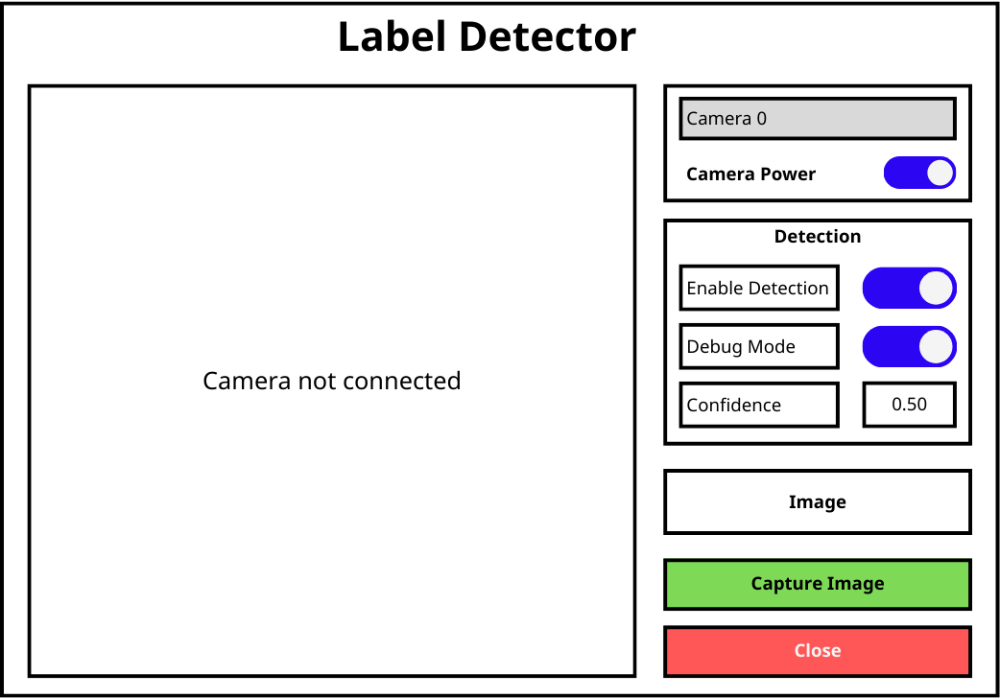

# Label Detector

Ứng dụng desktop phát hiện và phân đoạn nhãn sản phẩm (product labels) trong thời gian thực sử dụng mô hình YOLO11n-seg (Instance Segmentation).



## Tính năng

- **Camera Management**: Tự động phát hiện và chọn camera, bật/tắt camera
- **Instance Segmentation**: Phát hiện và phân đoạn nhãn với YOLO11n-seg (ONNX)
- **Mask Visualization**: Hiển thị segmentation mask với màu sắc và opacity tùy chỉnh
- **Adjustable Threshold**: Điều chỉnh ngưỡng confidence (0.0 - 1.0)
- **Size Filtering**: Lọc bỏ đối tượng quá lớn theo tỷ lệ diện tích
- **Top N Selection**: Chỉ hiển thị N đối tượng có confidence cao nhất
- **Image Capture**: Chụp và lưu ảnh gốc
- **Debug Mode**: Tự động lưu ảnh có annotation khi phát hiện đối tượng
- **Dark Theme**: Giao diện tối, thân thiện với mắt
- **Configurable**: Tất cả màu sắc và tham số có thể cấu hình từ file JSON

## Yêu cầu hệ thống

- Python 3.12 trở lên
- Camera (USB hoặc built-in)
- Hệ điều hành: Windows, Linux, macOS

## Cài đặt

### Bước 1: Clone repository

```bash
git clone https://github.com/nguyentrungtin1709/yolov11-label-detector.git
cd yolov11-label-detector
```

### Bước 2: Tạo môi trường ảo (Virtual Environment)

**Linux/macOS:**
```bash
python3 -m venv .venv
source .venv/bin/activate
```

**Windows:**
```bash
python -m venv .venv
.venv\Scripts\activate
```

### Bước 3: Cài đặt các gói phụ thuộc

```bash
pip install -r requirements.txt
```

### Bước 4: Kiểm tra model

Đảm bảo file model YOLO đã có trong thư mục `models/`:
```
models/
└── yolo11n-seg-version-1.0.1.onnx
```

## Khởi chạy ứng dụng

```bash
python main.py
```

Hoặc chạy với chế độ debug logging:
```bash
DEBUG=true python main.py
```

## Hướng dẫn sử dụng

1. **Chọn camera**: Chọn camera từ dropdown "Camera"
2. **Bật camera**: Bật toggle "Camera Power" (màu cam)
3. **Bật detection**: Bật toggle "Enable Detection" (màu xanh lá)
4. **Điều chỉnh threshold**: Thay đổi giá trị "Confidence" nếu cần
5. **Chụp ảnh**: Nhấn nút "Capture Image" để lưu ảnh gốc
6. **Debug mode**: Bật toggle "Debug Mode" để tự động lưu ảnh có annotation

## Cấu trúc thư mục

```
label-detector/
├── config/
│   └── app_config.json       # Cấu hình ứng dụng
├── core/                     # Core layer (interfaces & implementations)
│   ├── interfaces/           # Abstraction layer (ICameraCapture, IDetector, IImageWriter)
│   ├── camera/               # Camera implementation (OpenCVCamera)
│   ├── detector/             # YOLO detector implementation (YOLODetector)
│   └── writer/               # File writer implementation (LocalImageWriter)
├── services/                 # Service layer (business logic)
│   ├── camera_service.py     # Camera orchestration
│   ├── detection_service.py  # Detection + filtering logic
│   ├── image_saver_service.py # Image saving with annotations
│   └── performance_logger.py # FPS and timing metrics
├── ui/                       # UI layer (PySide6 widgets)
│   ├── main_window.py
│   └── widgets/
│       ├── camera_widget.py  # Video display with overlays
│       ├── config_panel.py   # Control panel
│       └── toggle_switch.py  # Custom toggle widget
├── models/
│   └── yolo11n-seg-version-1.0.1.onnx  # YOLO11n-seg model
├── output/
│   ├── captures/             # Ảnh chụp thủ công (raw)
│   └── debug/                # Ảnh debug tự động
│       ├── display/          # Ảnh có annotation (bbox + mask)
│       ├── original/         # Ảnh gốc (PNG)
│       ├── bbox/             # Crop theo bounding box
│       ├── mask/             # Crop theo mask (PNG với alpha)
│       └── txt/              # Tọa độ contour của mask
├── main.py                   # Entry point với Dependency Injection
├── requirements.txt          # Dependencies
└── README.md
```

## Cấu hình

File cấu hình: `config/app_config.json`

### Tham số cơ bản

| Tham số | Mô tả | Mặc định |
|---------|-------|----------|
| `modelPath` | Đường dẫn model ONNX | `models/yolo11n-seg-version-1.0.1.onnx` |
| `isSegmentation` | Bật chế độ segmentation | `true` |
| `confidenceThreshold` | Ngưỡng confidence | `0.5` |
| `inputSize` | Kích thước đầu vào model | `640` |
| `maxCameraSearch` | Số camera tối đa tìm kiếm | `2` |

### Filter Settings (Lọc kết quả)

| Tham số | Mô tả | Mặc định |
|---------|-------|----------|
| `filterSettings.maxAreaRatio` | Lọc đối tượng > X% diện tích ảnh | `0.15` |
| `filterSettings.topNDetections` | Số đối tượng tối đa hiển thị | `3` |

### Visualization (Hiển thị)

| Tham số | Mô tả | Mặc định |
|---------|-------|----------|
| `maskOpacity` | Độ trong suốt mask (0.0-1.0) | `0.4` |
| `maskColors` | Danh sách màu mask (BGR) | `[[128,0,128], ...]` |
| `boxColor` | Màu bounding box (BGR) | `[0, 255, 0]` |
| `textColor` | Màu text label (BGR) | `[0, 0, 0]` |

## Debug Mode Output

Khi bật Debug Mode và phát hiện đối tượng, ứng dụng tự động lưu (với cooldown 2 giây):

| Thư mục | Nội dung | Định dạng |
|---------|----------|----------|
| `debug/display/` | Ảnh có annotation (mask + bbox + label) | JPEG |
| `debug/original/` | Ảnh gốc không annotation | PNG |
| `debug/bbox/` | Crop theo bounding box | JPEG |
| `debug/mask/` | Crop theo mask với nền trong suốt | PNG (BGRA) |
| `debug/txt/` | Tọa độ contour của mask | TXT |

## Performance Logging

Khi bật `performanceLogging.enabled`, ứng dụng hiển thị:
- FPS thời gian thực trên status bar
- Thời gian xử lý: preprocess, inference, postprocess, filter

## Tài liệu

- [SPECIFICATION.md](SPECIFICATION.md) - Đặc tả hệ thống
- [CHANGELOG.md](CHANGELOG.md) - Lịch sử thay đổi


