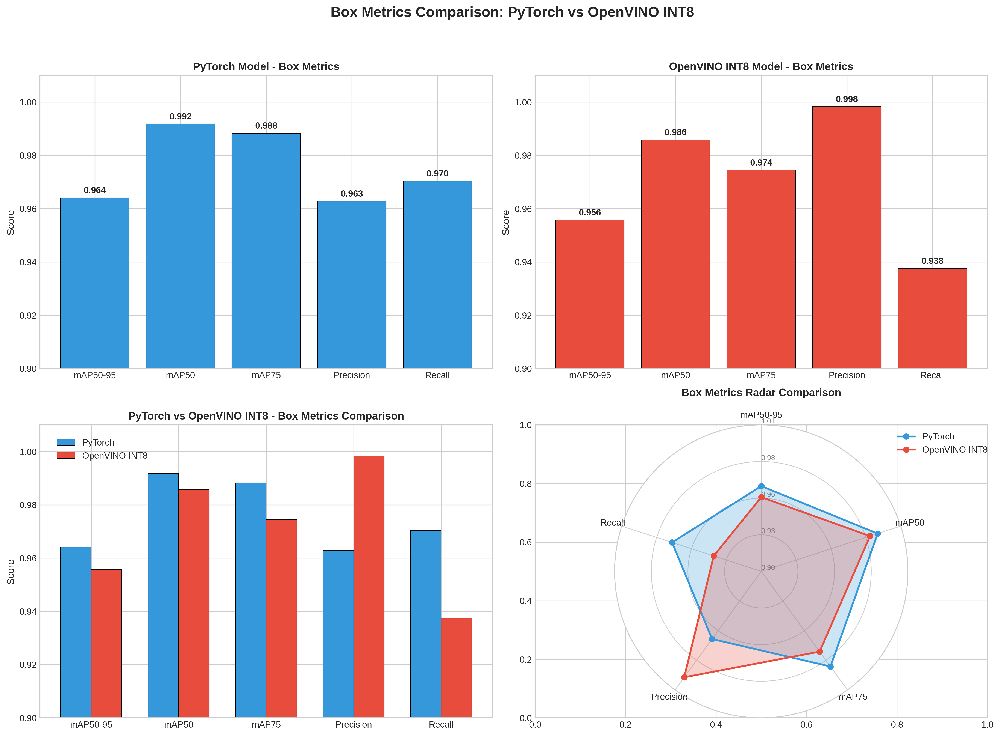
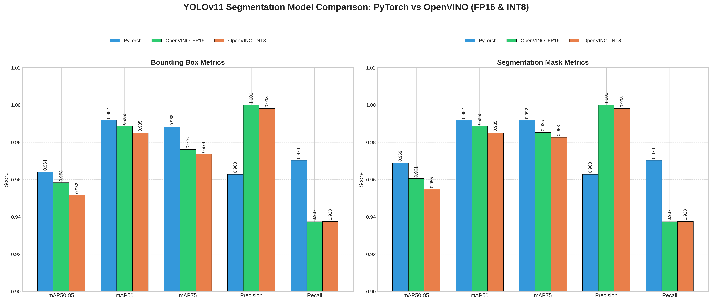

# Models

[**Version 1.0.0 (latest):**](../models/yolo11n-seg-version-1-0-0.onnx)
- Dataset: [Version D1.0.2](https://podsoftcomvn-my.sharepoint.com/:u:/g/personal/tinnt_podsoft_com_vn/IQAhJ3Qrdj-bQqFknVjqoRhOAYs6BKpsHJtMCARY8WDTEtg?e=dSONJR)
- Notebook: [Version N1.0.0](../notebooks/YOLOv11-Seg-N1.0.0.ipynb)
- Model (ONNX + PyTorch): [Version M1.0.0](https://podsoftcomvn-my.sharepoint.com/:u:/g/personal/tinnt_podsoft_com_vn/IQBZjfynMB8oQZBSlsiX7G6WAe8yEueqr5sly9LCoYdLBoM?e=31bljf)
- Model (OpenVINO): [Version OV1.0.0 INT8](https://podsoftcomvn-my.sharepoint.com/:u:/g/personal/tinnt_podsoft_com_vn/IQClJ0Y_KDIJQr_132wZBrKsAU29PPF6LL3w6-h1fSWqym0?e=twcrfk)
- Model (OpenVINO): [Version OV1.0.0 FP16](https://podsoftcomvn-my.sharepoint.com/:u:/g/personal/tinnt_podsoft_com_vn/IQC9-vS_h_o3Tqn6pTcgCJdlAZ4Fmr_MAIDWn6s7l3gSNAY?e=CmT3pY)
- Experiments Tracking: [Version D1.0.2-N1.0.0-E1](https://www.comet.com/tinntpod/yolo11-instance-segmentation/f328eff2a90840b5af1565b509d8a3fc)

**Evaluation Metrics (INT8):**

**Box (Bounding Box) Metrics Comparison:**

| Metric | PyTorch | OpenVINO INT8 | Difference |
|--------|---------|---------------|------------|
| mAP50-95 | 0.9641 | 0.9557 | -0.0083 |
| mAP50 | 0.9918 | 0.9858 | -0.0060 |
| mAP75 | 0.9883 | 0.9745 | -0.0138 |
| Precision | 0.9628 | 0.9983 | +0.0355 |
| Recall | 0.9703 | 0.9375 | -0.0328 |

**Mask (Segmentation) Metrics Comparison:**

| Metric | PyTorch | OpenVINO INT8 | Difference |
|--------|---------|---------------|------------|
| mAP50-95 | 0.9661 | 0.9538 | -0.0123 |
| mAP50 | 0.9918 | 0.9858 | -0.0060 |
| mAP75 | 0.9918 | 0.9832 | -0.0086 |
| Precision | 0.9628 | 0.9983 | +0.0355 |
| Recall | 0.9703 | 0.9375 | -0.0328 |

**Performance Summary:**
- Box mAP50-95 Degradation: -0.86%
- Mask mAP50-95 Degradation: -1.27%
- Analysis: INT8 quantization has minimal impact on model performance. The OpenVINO INT8 model maintains comparable accuracy with reduced size.

**Evaluation Metrics (FP16):**

**Model Comparison Chart:**

**Box (Bounding Box) Metrics Comparison:**

| Metric | PyTorch | OpenVINO FP16 | Difference |
|--------|---------|---------------|------------|
| mAP50-95 | 0.9641 | 0.9583 | -0.0058 |
| mAP50 | 0.9918 | 0.9886 | -0.0032 |
| mAP75 | 0.9883 | 0.9761 | -0.0122 |
| Precision | 0.9628 | 1.0000 | +0.0372 |
| Recall | 0.9703 | 0.9374 | -0.0329 |

**Mask (Segmentation) Metrics Comparison:**

| Metric | PyTorch | OpenVINO FP16 | Difference |
|--------|---------|---------------|------------|
| mAP50-95 | 0.9689 | 0.9605 | -0.0084 |
| mAP50 | 0.9918 | 0.9886 | -0.0032 |
| mAP75 | 0.9918 | 0.9853 | -0.0065 |
| Precision | 0.9628 | 1.0000 | +0.0372 |
| Recall | 0.9703 | 0.9374 | -0.0329 |

**Performance Summary:**
- Box mAP50-95 Degradation: -0.60%
- Mask mAP50-95 Degradation: -0.87%
- Analysis: FP16 quantization provides a good balance between performance and accuracy, with less than 1% degradation in mAP.
