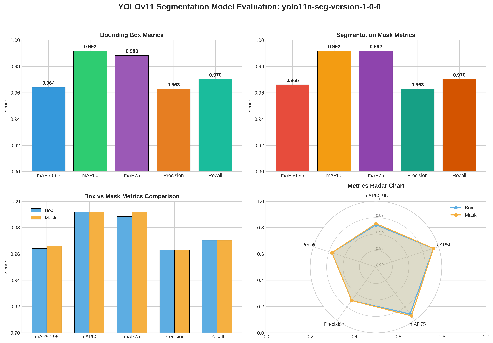

# Models

[**Version 1.0.0 (latest):**](../models/yolo11n-seg-version-1-0-0.onnx)
- Dataset: [Version D1.0.2](https://podsoftcomvn-my.sharepoint.com/:u:/g/personal/tinnt_podsoft_com_vn/IQAhJ3Qrdj-bQqFknVjqoRhOAQdc3Ur47xvAKETPPlMA3GU?e=tlH316)
- Notebook: [Version N1.0.0](../notebooks/YOLOv11-Seg-N1.0.0.ipynb)
- Model: [Version M1.0.0](https://podsoftcomvn-my.sharepoint.com/:u:/g/personal/tinnt_podsoft_com_vn/IQBZjfynMB8oQZBSlsiX7G6WAe8yEueqr5sly9LCoYdLBoM?e=31bljf)
- Experiments Tracking: [Version D1.0.2-N1.0.0-E1](https://www.comet.com/tinntpod/yolo11-instance-segmentation/f328eff2a90840b5af1565b509d8a3fc)

**Evaluation Metrics:**

| Metric | Bounding Box | Segmentation Mask |
|--------|--------------|-------------------|
| mAP50-95 | 0.9641 | 0.9661 |
| mAP50 | 0.9918 | 0.9918 |
| mAP75 | 0.9883 | 0.9918 |
| Precision | 0.9628 | 0.9628 |
| Recall | 0.9703 | 0.9703 |
